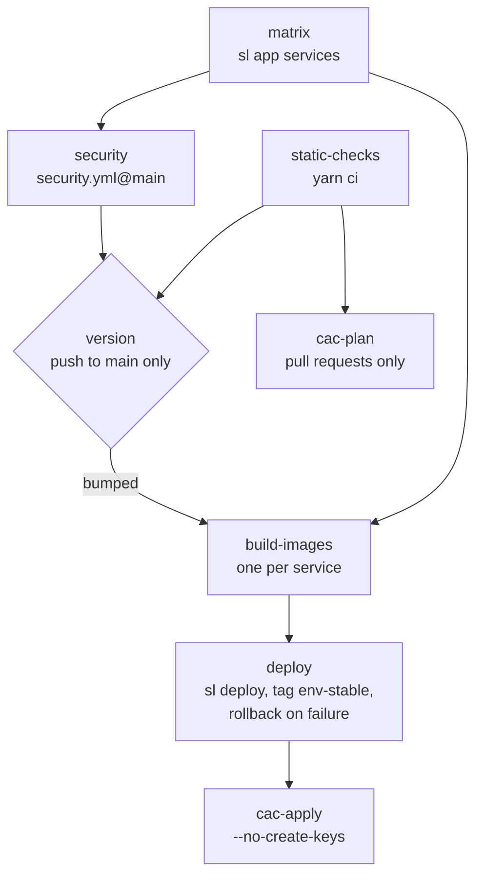

# `app-release.yml`

The release pipeline for **apps**. One reusable, one DAG: static checks and security on every
event, then — only on a push to `main` — version, build, deploy and config as code. Since v2 the
topology comes from the app's own `deploy/skylabs.yaml`, and the deploy is a single `sl deploy`.

## Stages



| Job | Runs on | What it does |
|---|---|---|
| `matrix` | every event but `repository_dispatch` | `yarn sl app services --json` reads the services from the descriptor. The list drives the build matrix and the images Grype scans. |
| `static-checks` | pull requests and pushes | `yarn ci` once, repo-wide: typecheck, lint, test, build. |
| `security` | every event but `repository_dispatch` | Calls [`security.yml@main`](./security.md) with the images from `matrix`. Grype only runs on push and schedule. |
| `version` | push to `main`, not on the bumper's own `chore(release): v…` commit | The **fork point**. Computes the next version from conventional commits, bumps every `package.json`, writes `CHANGELOG.md`, commits `chore(release): vX.Y.Z [skip ci]`, tags, pushes atomically, creates the GitHub release. |
| `build-images` | when `version` bumped | One image per service from the tag, pushed to GHCR as `vX.Y.Z`, `<sha>` and `latest`, where `<sha>` (and the `BUILD_COMMIT` build-arg) is the commit the tag points at. |
| `deploy` | when `version` bumped and `deploy` is `true` | `yarn sl deploy <env> --tag vX.Y.Z` in the `<env>` GitHub Environment: migrations, services in descriptor order, workers, smoke checks, edge and monitoring registration. Then tags every image `<env>-stable` (a failed retag only warns). If `sl deploy` itself fails or is cancelled, it rolls back — see [Rollback](#rollback). |
| `cac-plan` | pull requests | `yarn cac plan --env <env>` when the repo has `cac/stack.ts`. |
| `cac-apply` | after a successful (or skipped) deploy | `yarn cac apply --env <env> --no-create-keys` when the repo has `cac/stack.ts`. |
| `secrets-rotate` | `repository_dispatch: skylabs-operators-changed` only | Re-encrypts `deploy/secrets/*.env` for the current operators (`yarn sl secrets rotate`) and commits `chore(secrets): recipients del registro [skip ci]`. |

Dependabot pull requests skip `matrix`, `static-checks` and the CaC jobs: Dependabot does not
receive secrets on its own pull requests.

## FULL and REDUCED

- **REDUCED** (pull request, non-`main` push, schedule): `matrix`, `static-checks`, `security`
  and `cac-plan`. `version` never runs, so every job that `needs: [version]` and checks
  `bumped == 'true'` is unreachable.
- **FULL** (push to `main`): the whole chain.
- **Rotation** (`repository_dispatch`): only `secrets-rotate`. A change of recipients carries no
  code, so the checks and the image scan are skipped.

## How the version is decided

The `version` job is the only place a version number is decided.

| Commits since the last tag | Bump |
|---|---|
| Any type with `!` (`feat!:`, `fix(api)!:`) or a `BREAKING CHANGE:` footer | major |
| `feat` | minor |
| `fix`, `perf`, `refactor`, `revert` (and GitHub's `Revert "…"`) | patch |
| `chore(deps)`, `chore(deps-dev)`, `build(deps)`, `build(deps-dev)` | patch — a dependency bump changes what runs |
| Anything else (`chore`, `docs`, `test`…) | no release — nothing is built or deployed |

If the tag already exists it bumps the patch until it finds a free one.

**A run only publishes what it validated.** If `main` has moved past the commit the run was
started for, and the new commits trigger CI, the run publishes nothing and ends green with
`bumped=false` and a notice: the run of the newest commit validates and releases everything
(GitHub only cancels older *pending* runs). If the only new commits are `[skip ci]` ones (a
`secrets-rotate` commit), no newer run will come, so the job recomputes on top of them — up to
five times. When a concurrent release already covered everything, it exits cleanly with no
release.

## Rollback

Before deploying, the job reads what the droplet runs as last-good (`sl deploy <env> status`).
When `sl deploy` fails, the rollback **redeploys that release from its own checkout** —
`sl deploy <env> --tag <last-good> --skip-migrate` in a worktree of the last-good tag — so the
images, the compose fragment, the env, the edge and the monitoring all go back together.
The plain `sl deploy <env> rollback` only swapped the images, under the fragment and env of the
release that failed (DEP-04: appoint run 35770492946).

It falls back to the images-only rollback when:

- the deploy was **cancelled** (a timeout leaves minutes, not a full redeploy);
- the services do not agree on a single last-good `vX.Y.Z`, or it could not be read;
- the redeploy of the last-good release fails.

Migrations are never reverted: a migration must stay compatible with the previous image
(expand/contract). The rollback only runs when the `sl deploy` step itself failed; a failure
after it (the `<env>-stable` retag) does not undo a good deploy.

## Inputs

| Input | Type | Default | Meaning |
|---|---|---|---|
| `deploy-env` | string | `qa` | `qa` or `prod`: the GitHub Environment of `deploy` and the CaC jobs, and the `sl deploy` target. |
| `node-version` | string | `24` | Node for every job. |
| `runner-labels` | string (JSON) | `["self-hosted","linux","x64","skylabs"]` | Where the jobs run. |
| `deploy` | boolean | `true` | `false` runs everything except the deploy (CI, version, image, security, CaC). For a service whose host is not a stack of the descriptor and deploys with its own job. |

## Outputs

| Output | Meaning |
|---|---|
| `version` | The version this run published, without the `v` (`0.3.1`). Empty when there was no bump. |
| `bumped` | `true` if this run published a new version. |

A caller that deploys on its own (`deploy: false`) needs `version`: the image is built from the
bump commit, so the caller's `github.sha` is **not** the image's commit.

## Secrets

All optional, passed with `secrets: inherit`: `GHCR_TOKEN`, `SEMANTIC_RELEASE_APP_ID`,
`SEMANTIC_RELEASE_PRIVATE_KEY`, `DEPLOY_SSH_KEY`, `SOPS_AGE_KEY`, `INFRA_READ_TOKEN`,
`IDACHU_CAC_KEY`. See [Getting started](./getting-started.md#org-secrets-the-reusables-read).

## Contract with the Dockerfiles

Every image is built with two build arguments:

| Build arg | Value |
|---|---|
| `APP_VERSION` | `vX.Y.Z`, the version `version` just tagged |
| `BUILD_COMMIT` | the `main` commit being built |

A Dockerfile that wants them declares `ARG APP_VERSION` / `ARG BUILD_COMMIT` and fixes them as
`ENV`. Runtime code reads the version in this order, never from `package.json` in production:
`APP_VERSION` → `BUILD_COMMIT` → `package.json` version → `"unknown"`.

Private `@skylabs-digital/*` packages are installed inside the build through a BuildKit secret:

```dockerfile
RUN --mount=type=secret,id=npm_token \
    NODE_AUTH_TOKEN=$(cat /run/secrets/npm_token) \
    yarn install --immutable
```

## Config as code jobs

Opt-in by presence: a repo with `cac/stack.ts` gets them, a repo without it sees them skip.

- On a pull request, `cac-plan` shows the drift against the platform catalog.
- On `main`, `cac-apply` runs **after** the deploy, so the code is live before the catalog
  (roles, flags, templates) is aligned to it. It never creates API keys — creating secret
  material is a human act.
- Credentials come from the GitHub Environment named after `deploy-env`: variables
  `IDACHU_URL`, `NOTEN_URL`, `FISTO_URL` and the secret `IDACHU_CAC_KEY`. Without the secret the
  jobs warn and exit `0`, so a repo can adopt a stack before the key exists.

:::warning `yarn cac` and `@skylabs-digital/cac` 2.x
Both CaC jobs still invoke `yarn cac plan|apply`. Since `@skylabs-digital/cac` 2.0.0 the CLI is
`sl cac` (from `@skylabs-digital/cli`) and the `cac` package ships no binary, so a repo on cac 2.x
needs a `cac` script (`"cac": "sl cac"`) until the jobs move to `yarn sl cac`.
:::

## Secret rotation

When the platform's operator list changes, the infra repo sends the `skylabs-operators-changed`
dispatch to every app. `secrets-rotate` then re-encrypts the app's `deploy/secrets/*.env` for the
new list and pushes the commit with the release App token. The **values** do not change — only
who can decrypt them. Rotating recipients does not revoke what a departed operator already saw:
old blobs stay in git history, so rotating the values themselves is a manual runbook.

The job runs **without** an `environment:` on purpose: `SOPS_AGE_KEY` is an organization
secret, and an Environment would only add required reviewers — an operator's removal must not
wait for an approval. If the secret is missing, the job fails with an explicit message.

The caller must declare the trigger and the split concurrency group; see
[Getting started](./getting-started.md#an-app).
