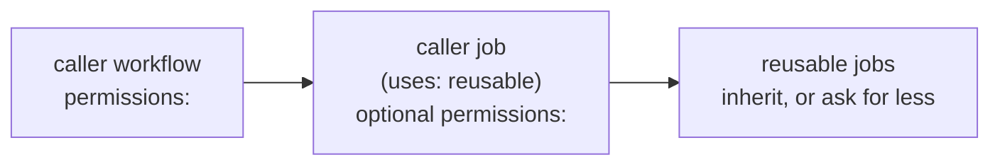

# Permissions and startup failures

A **startup failure** is a run that dies before any job starts: no logs, no steps, just a red
run marked "startup failure" (or "workflow file issue"). With reusables it has two usual causes,
and both are invisible until the workflow is on `main`.

## How permissions flow



- The caller's workflow-level `permissions:` is the ceiling for its jobs.
- A caller job that calls a reusable (`uses:`) can set its own `permissions:`; that becomes the
  ceiling for every job inside the reusable.
- A job **inside** the reusable can only keep or reduce what it receives. If it requests a
  permission the caller did not grant, GitHub rejects the whole run at compile time — on every
  event, before `continue-on-error` or any `if:` can help.

## Cause 1: a reusable job asks for a permission

Real case: the weekly security issue needs `issues: write`. The job first declared it:

```yaml
  weekly-security-report:
    permissions:
      issues: write   # every caller that did not grant it: startup failure
```

Every repo whose caller granted only `contents: read` stopped running security at all. The fix
was to **remove** the job-level block and let the job inherit: callers that want the issue grant
`issues: write` at workflow level; the others get a `403` at runtime, which `continue-on-error`
absorbs.

Rules for this repo:

- A reusable declares **no** workflow-level `permissions:`.
- A reusable job may declare `permissions:` only to **reduce** (as `secrets-rotate` does with
  `contents: read`).
- Anything extra a reusable needs is documented as a requirement of the caller.

The same rule is why [`docs-publish.yml`](../docs-publish.md) is its own reusable instead of a job
inside `app-release.yml`: it needs `id-token: write`, the app callers do not grant it to their
release, and one job asking for it would have failed every app's release at startup. The grant
lives on the caller's `docs` job only.

## Cause 2: `secrets.*` in a step-level `if:`

A reusable cannot reference `secrets.*` inside a step's `if:`: it is a startup failure too.
Copy the secret's presence into a step output first, then gate on the output:

```yaml
      - name: Detect App Token availability
        id: has-app
        env:
          APP_ID: ${{ secrets.app-id }}
        run: |
          if [ -n "${APP_ID}" ]; then echo "available=true" >> "$GITHUB_OUTPUT"; else echo "available=false" >> "$GITHUB_OUTPUT"; fi
      - name: Generate GitHub App Token
        if: steps.has-app.outputs.available == 'true'
```

## What callers grant

| Caller | Workflow-level `permissions:` | Why |
|---|---|---|
| App `release.yml` | `contents: write`, `packages: write`, `id-token: write` | Checkout, GHCR pushes from `build-images` |
| Library `release.yml` | `contents: write`, `packages: write`, `id-token: write`, optionally `issues: write` | Publish to GitHub Packages with `GITHUB_TOKEN`; the weekly issue |
| `security.yml` alone | `contents: read` | Read-only scan |
| `docs` job | job-level `contents: read`, `id-token: write` | The OIDC token the docs service validates |

Release commits and tags are pushed with the GitHub App token, not with `GITHUB_TOKEN`, so the
caller does not need anything extra for them.

## Catching it before `main`

This repo's own `ci.yml` runs on every pull request that touches `.github/workflows/**`,
`scripts/**` or `bootstrap.sh`:

- **actionlint** (schema, expressions, shellcheck of `run:` blocks);
- an **empty-mapping check** — `env:`, `with:`, `secrets:`, `permissions:`, `outputs:` or `inputs:`
  with a null value parse in YAML but make GitHub answer "workflow file issue";
- **shellcheck** of `scripts/*.sh` and `bootstrap.sh`.

None of them can see what a *caller* grants. When you add or change a `permissions:` anywhere in
a reusable, check it against the table above and against the fleet's callers.
