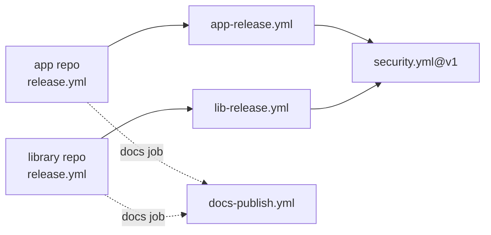

# CI/CD workflows

The org repo `skylabs-digital/.github` holds the **reusable workflows** every Skylabs repo calls.
A repo's own `.github/workflows/release.yml` is a thin caller: it declares triggers and
permissions, then hands the whole pipeline to one of these.

| | |
|---|---|
| Repo | [`skylabs-digital/.github`](https://github.com/skylabs-digital/.github) (public) |
| Status | 🟢 Stable — every app and library in the fleet releases through it |
| Consumed at | `@main` for the release and docs pipelines, `@v1` for `security.yml` |

## The reusables

| Workflow | Called by | What it does |
|---|---|---|
| [`app-release.yml`](./app-release.md) | apps | CI, security, version bump, image build, `sl deploy`, config as code, secret rotation |
| [`lib-release.yml`](./lib-release.md) | libraries | CI, mutation testing, security, semantic-release to GitHub Packages |
| [`security.yml`](./security.md) | the two above, and repos with no release pipeline | OSV-Scanner, Gitleaks, Grype, a weekly rolling issue |
| [`docs-publish.yml`](./docs-publish.md) | every repo with `docs/public/` | announces the docs section and publishes the pages, with its own `sl` and the job's OIDC token |

## One pipeline, two shapes

Every release reusable forks **inside itself** between two runs:

- **REDUCED** — pull requests (and any non-`main` push): static checks and security. Nothing
  is versioned, built or deployed.
- **FULL** — a push to `main`: the same checks, then version, publish or build, and deploy.

The fork point is a single job guarded by `github.event_name == 'push' && github.ref ==
'refs/heads/main'` (`version` in apps, `release` in libraries). Every later job `needs:` it, so on
a pull request the tail is structurally unreachable. Callers never encode the fork themselves.

## Design choices that apply everywhere

- **Third-party actions are SHA-pinned** in the reusables, so every caller inherits the
  supply-chain hardening.
- **Husky is off on the runner** (`HUSKY: 0`). CI is the gate; hooks would re-run `yarn ci`
  inside the release push and widen the window in which a concurrent merge rejects it.
- **Releases retry by recomputing.** When `main` moves during a release, the release commit is
  discarded and the version is computed again from the fresh `main` — never rebased.
- **Self-hosted runners** labelled `[self-hosted, linux, x64, skylabs]` run every job.
- **No `permissions:` escalation inside a reusable.** Permissions come from the caller; see
  [Permissions and startup failures](./guides/permissions-and-startup-failures.md).

## Where to start

- [Getting started](./getting-started.md) — wire a new repo to the right reusable.
- [app-release.yml](./app-release.md) — the stage-by-stage walkthrough.
- [Permissions and startup failures](./guides/permissions-and-startup-failures.md) — the trap
  that turns a whole run red before it starts.

This repo also serves [`bootstrap.sh`](./guides/bootstrap-a-new-machine.md), the one-line setup
of a new machine, and [`sync-dependabot.sh`](./guides/sync-dependabot.md).
