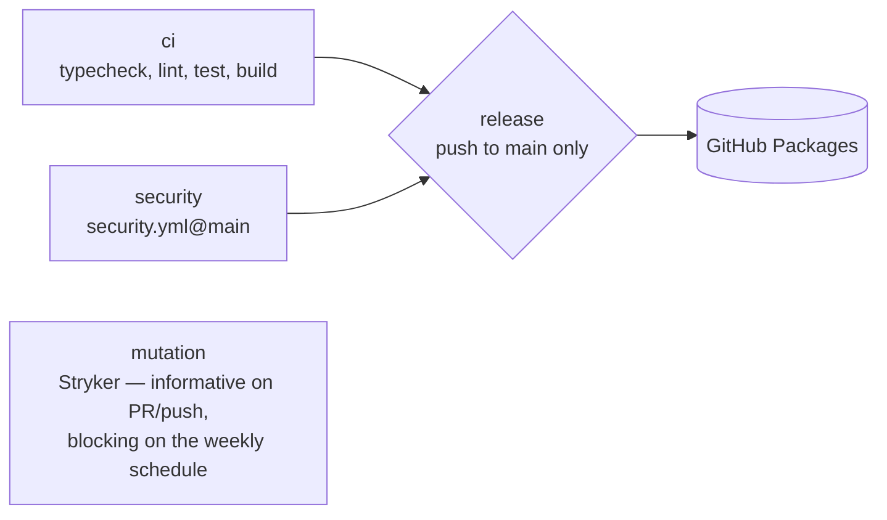

# `lib-release.yml`

The release pipeline for **npm libraries**: `ci` and `security` on every pull request; on a push
to `main`, also `release`, which runs semantic-release and publishes to GitHub Packages. The
weekly `schedule` the caller declares runs `security` and the full `mutation` gate.

## Jobs

| Job | Runs on | What it does |
|---|---|---|
| `ci` | pull requests and pushes | `yarn install --immutable`, `yarn typecheck`, `yarn lint`, `extra-ci-steps`, `yarn test --coverage`, `yarn build`, `extra-ci-steps-post-build`. |
| `mutation` | pull requests and pushes (incremental), and the weekly `schedule` / `workflow_dispatch` (full), when `run-mutation` | See [The mutation gate](#the-mutation-gate). Not a dependency of `release`. |
| `security` | every event | [`security.yml@main`](./security.md) without images. |
| `release` | push to `main` | The **fork point**. Builds and runs semantic-release: version from conventional commits, `CHANGELOG.md`, publish, GitHub release. |

`release` waits for `ci` and `security` only: a real failure in either blocks it. `mutation` runs
in parallel and never delays or blocks a publish.

## The mutation gate

| Event | Mode | Command | Below `thresholds.break` |
|---|---|---|---|
| pull request, push | incremental, only when `mutation-on-change` | `yarn test:mutation` (or `yarn mutation`), reusing the cached `.stryker-tmp/incremental.json` | warning + job summary; the job passes |
| weekly `schedule`, `workflow_dispatch` | full | `yarn test:mutation:full` if the library has it, else `yarn test:mutation --force` | **the job fails** (with the default `mutation-break-blocks: schedule`) |

- The job summary always shows the absolute mutation score, the `break` threshold, the mode and
  whether the event was blocking.
- A Stryker run that cannot measure at all — typically failing tests in its initial dry run — is
  reported as such, not as a low score, and fails the scheduled run too.
- The full run saves its incremental file as the newest `main` cache, so pull requests reuse a
  result that is at most a week old.
- `break` is an absolute score over the whole library, not over the diff; that is why it does not
  block pull requests. A library whose floor is out of reach pins `break` to its measured score
  and ratchets it up.

:::note The reusable does not run `yarn ci`
`ci` runs fixed steps, so a gate you add to your own `ci` script (a spec check, a dual-format
smoke test) exists in your pre-push hook and nowhere in CI. Declare it with `extra-ci-steps` (runs
after lint, before tests) or `extra-ci-steps-post-build` (runs after the build, when `dist/`
exists).
:::

## Inputs

| Input | Type | Default | Meaning |
|---|---|---|---|
| `node-version` | string | `24` | Node for every job. |
| `build-tool` | string | `tsc` | Informational (`tsc`, `tsup`, `tsdown`, `vite`); the job always runs `yarn build`. |
| `run-mutation` | boolean | `true` | Master switch for the `mutation` job on every event. |
| `mutation-on-change` | boolean | `true` | Run the incremental job on pull requests and pushes. `false` = mutation runs only on the weekly schedule. |
| `mutation-break-blocks` | string | `schedule` | Where a score below `break` fails the job: `never`, `schedule` or `always`. |
| `mutation-timeout-minutes` | number | `60` | `timeout-minutes` of the `mutation` job. |
| `extra-ci-steps` | string | `''` | Shell run inside `ci` after lint and before tests. Empty = skipped. |
| `extra-ci-steps-post-build` | string | `''` | Shell run inside `ci` after the build. Empty = skipped. |
| `coverage-floor` | number | `90` | **Deprecated.** Accepted for compatibility; nothing reads it. Enforce coverage in the library's vitest config. |

Secrets, all optional through `secrets: inherit`: `GHCR_TOKEN` (installs), and
`SEMANTIC_RELEASE_APP_ID` / `SEMANTIC_RELEASE_PRIVATE_KEY` (the App token that pushes the release
commit and tag). The publish itself authenticates with the job's `GITHUB_TOKEN`, which is why
the caller grants `packages: write`.

## What the library provides

- Scripts: `typecheck`, `lint`, `test`, `build`; `test:mutation` or `mutation` for Stryker, and
  optionally `test:mutation:full` for the weekly run (otherwise `test:mutation --force`).
- A weekly `schedule` in the caller's `on:` — that run is the mutation gate.
- A semantic-release configuration with `branches: ["main"]` and the npm, changelog, git and
  github plugins. The git plugin commits `chore(release): x.y.z [skip ci]`.
- `publishConfig.registry: https://npm.pkg.github.com`.

## When `main` moves during a release

The release commit is pushed in semantic-release's `prepare` step, **before** `publish`, so a
rejected push published nothing. The job then checks whether `main` moved: if it did, it resets
to the fresh `main`, reinstalls, rebuilds and lets semantic-release compute the version again —
up to three times. If `main` did not move, the failure is real and it stops.
